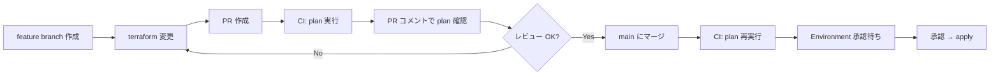

# terraform-state-s3-github-actions

Terraform Cloud を使わず、AWS S3 のネイティブ Lock 機能 (Terraform v1.10+) と GitHub Actions (OIDC 認証) で
Terraform の state 管理と CI/CD を構築するリポジトリ。

## 構成概要

```
.
├── .github/workflows/terraform.yml     # CI/CD: PR で plan、main push で apply
├── bootstrap/                          # state 管理リソース自身を作る (state はローカル管理)
│   ├── main.tf
│   ├── variables.tf
│   ├── outputs.tf
│   └── README.md
└── terraform/
    └── environments/
        ├── prod/                       # 本番環境
        ├── stg/                        # ステージング環境
        └── dev/                        # 開発環境
```

| コンポーネント | 役割 |
|---|---|
| `bootstrap/` | tfstate 用 S3 バケットと IAM ロール/ポリシーを作成。GitHub OIDC Provider は既存を `data` で参照。**初回 1 度だけローカルから apply** |
| `terraform/environments/<env>/` | 各環境のリソース定義。S3 backend で state を共有 |
| `.github/workflows/terraform.yml` | PR で plan、main push で apply。GitHub Environments で承認を要求 |

### state key 設計

すべての環境の state は同一 S3 バケット (`learn-tf-tfstate-456788081138`) 内に環境名でプレフィックスを切って配置:

```
s3://learn-tf-tfstate-456788081138/
├── prod/terraform.tfstate
├── prod/terraform.tfstate.tflock     # Terraform v1.10+ native lock
├── stg/terraform.tfstate
├── stg/terraform.tfstate.tflock
├── dev/terraform.tfstate
└── dev/terraform.tfstate.tflock
```

## 初回セットアップ手順

### 1. bootstrap の apply (ローカルから 1 度だけ)

```bash
cd bootstrap/
# AWS クレデンシャル設定済みであること (admin 相当)
aws sts get-caller-identity   # Account ID: 456788081138 を確認
terraform init
terraform plan
terraform apply
```

apply 完了後、出力された以下の値を確認:

- `tfstate_bucket_name` → `learn-tf-tfstate-456788081138`
- `github_actions_role_arn` → `arn:aws:iam::456788081138:role/github-actions-terraform`

詳細は [`bootstrap/README.md`](bootstrap/README.md) 参照。

### 2. GitHub Variables の設定 (任意)

ワークフロー中で role ARN を直接埋め込んでいるため必須ではないが、複数リポジトリで使い回す場合などは
リポジトリ Variables に登録しておくと良い。

| Variables / Secrets | 値 | 用途 |
|---|---|---|
| `AWS_ACCOUNT_ID` (Variable) | `456788081138` | (任意) リソース命名や参考表示用 |

機密情報 (`AWS_ACCESS_KEY_ID` 等) は OIDC 利用のため不要。

### 3. GitHub Environments の設定 (重要)

apply ジョブは `environment: <env>` を指定しているため、各環境について **GitHub Environments の保護ルール**を設定する。

GitHub リポジトリ → **Settings → Environments → New environment** で以下 3 つを作成:

- `dev`
- `stg`
- `prod`

各 Environment で:
- **Required reviewers**: 1 名以上のレビュアー必須にチェックし、自分自身などを登録
- **Deployment branches**: `main` ブランチのみに制限 (Selected branches → `main`)

これにより、apply ジョブは承認ボタンを押すまで待機状態になる (全環境で手動承認方針)。

### 4. 動作確認

```bash
cd terraform/environments/dev/
terraform init           # S3 backend が認識され、reconfigure 完了する
terraform plan           # ローカルからは AssumeRole できないため失敗が想定 (CI 経由で実行)
```

PR を作成 → GitHub Actions が plan を実行 → PR コメントに plan 結果が投稿される
→ `main` にマージ → apply ジョブが承認待ち → 承認 → apply 実行

## 日常的な開発フロー



1. feature ブランチ作成
2. `terraform/environments/<env>/` 配下を編集
3. PR 作成 → GitHub Actions が全環境で plan
4. PR コメントで差分確認
5. レビュー後 `main` にマージ
6. apply ジョブが `dev` → `stg` → `prod` の順に実行 (各環境で手動承認)

### 環境を限定して手動実行

GitHub Actions → **Terraform** ワークフロー → **Run workflow** で `environment` と `action` (`plan`/`apply`) を選択して実行可能。

## トラブルシューティング

### lock の解除

別の plan/apply が中断して `.tflock` が残ってしまった場合:

```bash
cd terraform/environments/<env>/
terraform init
terraform force-unlock <LOCK_ID>     # plan のエラーメッセージに ID が出る
```

`.tflock` は S3 上のオブジェクト (`<env>/terraform.tfstate.tflock`) として残るので、AWS CLI で直接削除することも可能 (最終手段):

```bash
aws s3 rm s3://learn-tf-tfstate-456788081138/<env>/terraform.tfstate.tflock
```

### state 破損時のリカバリ

tfstate バケットはバージョニング有効。直前の正常版にロールバック可能:

```bash
aws s3api list-object-versions \
  --bucket learn-tf-tfstate-456788081138 \
  --prefix <env>/terraform.tfstate

# 直前の VersionId を控え、復元
aws s3api copy-object \
  --bucket learn-tf-tfstate-456788081138 \
  --copy-source "learn-tf-tfstate-456788081138/<env>/terraform.tfstate?versionId=<VERSION_ID>" \
  --key <env>/terraform.tfstate
```

### OIDC AssumeRole が失敗する

- IAM ロールの `sub` 条件が `repo:Mo3g4u/terraform-state-s3-github-actions:*` に一致するか確認
- workflow の `permissions: id-token: write` が指定されているか確認
- `aws-actions/configure-aws-credentials@v4` の `role-to-assume` が正しい ARN になっているか確認

## 命名規則・タグ規約

### 命名規則

| 種別 | パターン | 例 |
|---|---|---|
| tfstate バケット | `<project>-tfstate-<account_id>` | `learn-tf-tfstate-456788081138` |
| 環境リソース (S3) | `<project>-<purpose>-<env>` | `learn-tf-sample-prod` |
| IAM ロール | `github-actions-terraform` | (固定) |

### 共通タグ (default_tags で自動付与)

| タグキー | 値 | 説明 |
|---|---|---|
| `Project` | `learn-tf` | プロジェクト識別子 |
| `Environment` | `prod` / `stg` / `dev` | 環境識別子 |
| `ManagedBy` | `terraform` | Terraform で管理されていることを明示 |

bootstrap 側は `ManagedBy = "terraform-bootstrap"` でローカル管理のものと区別。

## IAM 権限について (要メンテナンス)

現状、GitHub Actions 用 IAM ロールには **最小権限** のみ付与している:

- tfstate バケットへの読み書き + `.tflock` 操作
- `learn-tf-sample-*` プレフィックスの S3 バケット管理

新規リソース種別 (EC2, RDS, IAM など) を `terraform/environments/<env>/` に追加するときは、
[`bootstrap/main.tf`](bootstrap/main.tf) の `aws_iam_policy_document.managed_resources` を編集し、
必要な action と resource を **最小限の範囲で** 追加すること。

## 参考

- [Terraform S3 backend (native locking)](https://developer.hashicorp.com/terraform/language/backend/s3)
- [GitHub OIDC for AWS](https://docs.github.com/en/actions/deployment/security-hardening-your-deployments/configuring-openid-connect-in-amazon-web-services)
